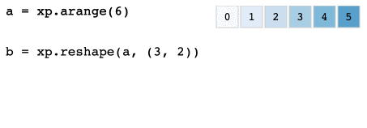

# op-art

Animated array operations.



## Introduction

The goal of **op-art** is to help understand array operations in NumPy (and related projects) by visualizing their effect on small arrays. In particular, it helps you understand how different operations change the shapes of arrays, and how values from different cells are combined to create new arrays.

The idea is to make it easy for you to generate visualizations for your own code with very little effort. This is achieved by providing an implementation of the fledgling [Python array API standard](https://data-apis.org/array-api/latest/index.html) that tracks cell-level dependencies between arrays being operated on, and using that information to produce interactive animations of the operations in a code snippet. You can then switch the array namespace to `op_art` and run your code unchanged.

Here's a slightly more advanced [example](https://tomwhite.github.io/op-art/misc/reshape_flip_reshape.html) that runs `reshape`, then `flip`, then `reshape` on an array.

The array standard is in most cases identical to NumPy - the reason it was chosen here was because it is more tractable than NumPy, which has a very large API.

See [examples](https://tomwhite.github.io/op-art) of each of the operations from the Python array API standard.
## How to use it

Install in a suitable Python env with:

```bash
pip install git+https://github.com/tomwhite/op-art.git jupyter
```

Start Jupyter by typing `jupyter notebook` and create a new Python 3 notebook.

Enter the following in a cell, then run it. You should see an animation like the one above.

```
import op_art as xp
a = xp.arange(6)
b = xp.reshape(a, (3, 2))
xp.visualize(a, b)
```

Here's the resulting [notebook](https://nbviewer.jupyter.org/github/tomwhite/op-art/blob/main/op_art.ipynb).

Try playing with different array operations to see how they behave.

## How it works

Note that you don't need to read anything below to use the library.

### Model

A new array object is used to encapsulate the raw array data and metadata to track cell dependencies and other information to produce a visualization.

Every array is an instance of `Array` (in the `op_art._array_object` namespace), which contains the underlying NumPy array, a unique ID, and an `ArrayRepresentation` object.

`Array` implements the contract defined in the [Array object array API](https://data-apis.org/array-api/latest/API_specification/array_object.html), which includes things like the `dtype` and `shape` attributes, and methods like `__add__` for adding two arrays together, or `__neg__` for returning an array where each element is the negative value.

(Note that a lot of the implementation is not concerned with visualization _per se_, and as a result has been copied from the implementation of the array API for NumPy at https://github.com/data-apis/numpy/blob/array-api/numpy/_array_api.)

The `ArrayRepresentation` is designed to contain enough information so that a visualization component can render it in a useful way. It contains the array's ID, dtype kind, shape, and number of dimensions. It also contains metadata about the cells in the array. Each cell is given a tracking ID, and crucially a `sources` attribute which references the cells that it was created from.

As an example, here is the representation for the array created by `a = xp.arange(6)` (`xp` is the convention for running array API examples):

```
ArrayRepresentation(
    id=0,
    kind='i',
    ndim=1,
    shape=(6,),
    cells=(
        CellRepresentation(id='0_0', index=(0,), value=0, sources=None),
        CellRepresentation(id='0_8', index=(1,), value=1, sources=None),
        CellRepresentation(id='0_16', index=(2,), value=2, sources=None),
        CellRepresentation(id='0_24', index=(3,), value=3, sources=None),
        CellRepresentation(id='0_32', index=(4,), value=4, sources=None),
        CellRepresentation(id='0_40', index=(5,), value=5, sources=None)
    )
)
```

Since we created the array from scratch, it doesn't depend on any other arrays, so the `sources` attributes are all `None`.

To continue the example, let's call `b = xp.reshape(a, (3, 2))`. This gives us:

```
ArrayRepresentation(
    id=1,
    kind='i',
    ndim=2,
    shape=(3, 2),
    cells=(
        CellRepresentation(id='1_0', index=(0, 0), value=0, sources=['0_0']),
        CellRepresentation(id='1_8', index=(0, 1), value=1, sources=['0_8']),
        CellRepresentation(id='1_16', index=(1, 0), value=2, sources=['0_16']),
        CellRepresentation(id='1_24', index=(1, 1), value=3, sources=['0_24']),
        CellRepresentation(id='1_32', index=(2, 0), value=4, sources=['0_32']),
        CellRepresentation(id='1_40', index=(2, 1), value=5, sources=['0_40'])
    )
)
```

Now the `sources` show where each cell in the reshaped array has come from. For example, the (1, 0) cell comes from the (2,) cell in the original (ID `0_16`).

Populating the `sources` attribute for every operation in the API is a challenge, and is not something that in general can be extracted from existing array implementations. While some operations are very easy to implement (such as elementwise operations), some are more challenging (such as `matmul`) and essentially require writing from scratch.

### Visualization

The data model described above makes it possible to produce a visualization that animates each operation in the API. Here's the simple `reshape` example from above.


The implementation here uses [D3](https://d3js.org/), and the idea of [object constancy](https://bost.ocks.org/mike/constancy/) to animate cells from an input array to an output. Some cells have multiple sources from multiple arrays (such as [`matmul`](https://tomwhite.github.io/op-art/linear_algebra_functions/matmul.html)), which this model is flexible enough to support.

### Development

How to build and test the library (for developers):

```bash
conda create --name op-art python=3.8
conda activate op-art
pip install -r requirements.txt
pytest
```
